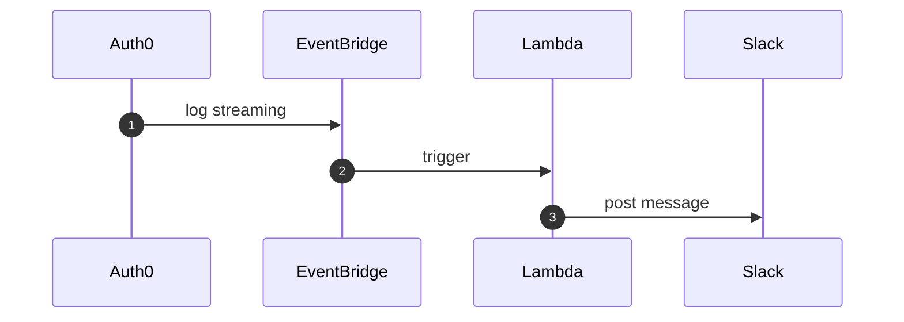

# Summary

以下 Zenn 記事のサンプルコード

[[Auth0] エラーログを Slack 通知する](https://zenn.dev/taroshun32/articles/auth0-error-slack)

```mermaid
sequenceDiagram
  autonumber
  Auth0->>EventBridge: log streaming
  EventBridge->>Lambda: trigger
  Lambda->>Slack: post message
```
